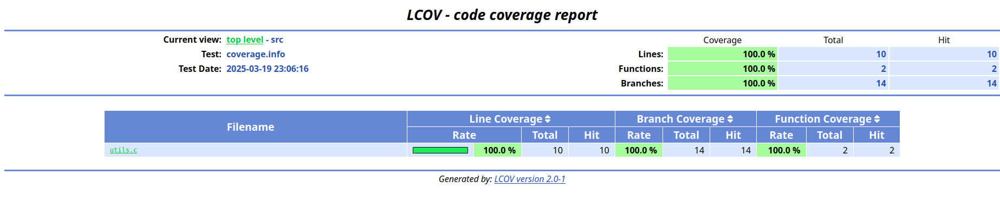

# code_coverage_c
This repository examplifies the use of lcov and gcov for code coverage in C. 
It is important to note that lcov framework does not have implementation for MC/DC coverage.
Part of the code in `test_utils.c` was foucused on simulating an MC/DC test coverage for one the `anything`
function on `utils.c`.

## Requirements

* gcc
* make
* lcov
* gcov

## Commands

### Build

```bash
make all
```
### Test

```bash
make run
```
### Gerating coverage report

```bash
make coverage
```
### Removing generated files
```bash
make clean
```
### LCOV Report



## Reference
* [LCOV](https://github.com/linux-test-project/lcov) 
* [GCOV/LCOV Example 1](https://github.com/shenxianpeng/gcov-example) 
* [GCOV/LCOV Example 2](https://github.com/akafael/c-project-template) 
